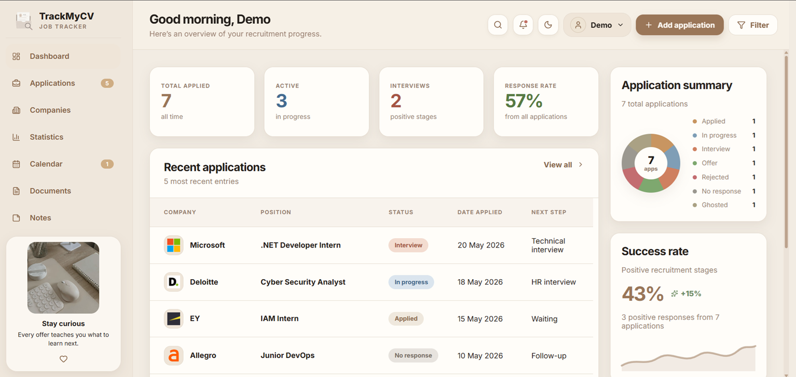
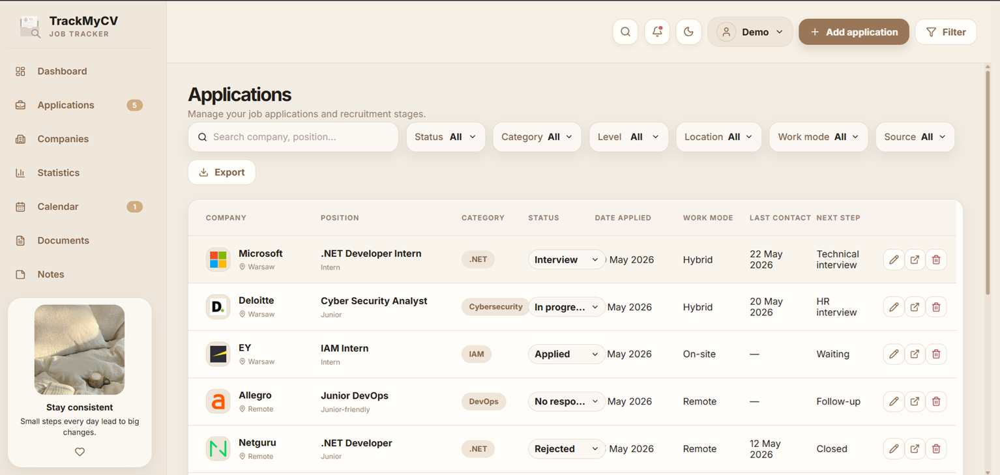
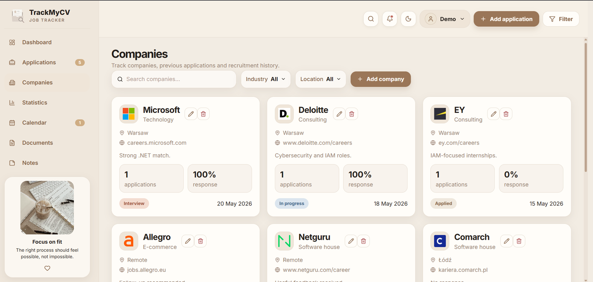
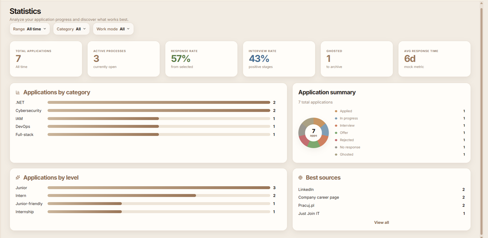
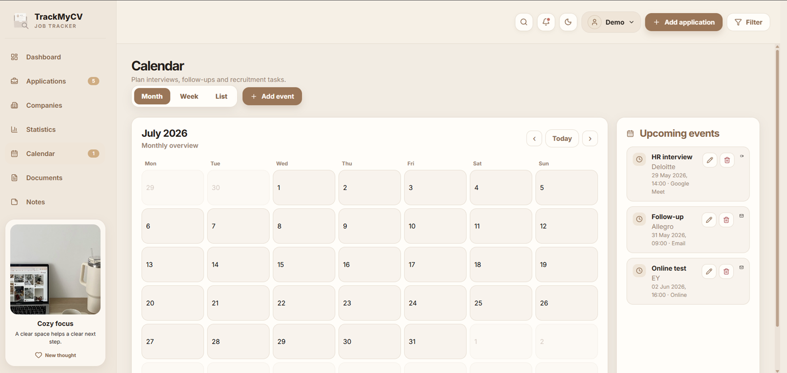
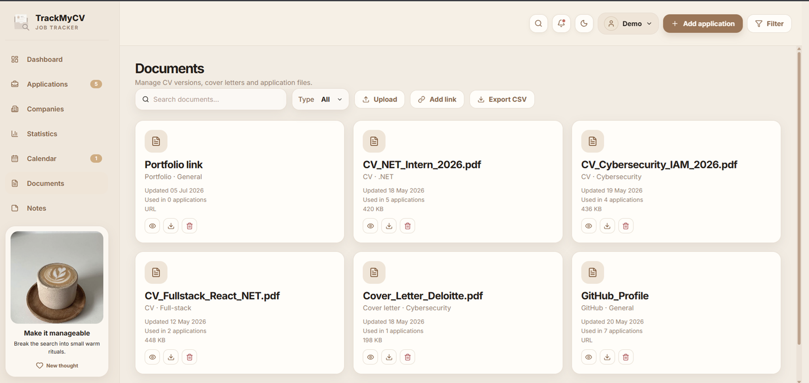
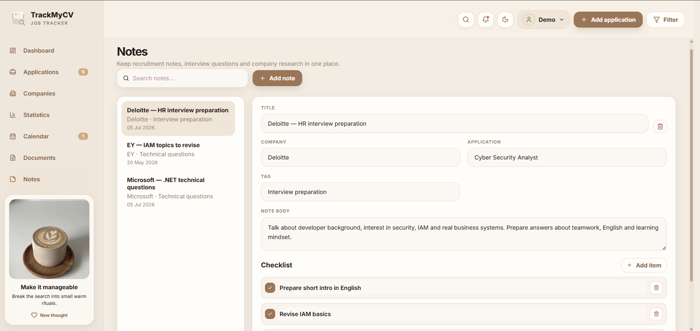

<p align="center">
  
</p>

<h1 align="center">Job Application Tracker</h1>

<p align="center">
  <strong>Modern web application for tracking job applications, recruitment stages, interviews and application progress</strong>
</p>

<p align="center">
  
  
  
  
  
  
  
</p>
<p align="center">
  <a href="https://avuii.github.io/TrackMyCV/">
    <strong>Open Live Demo</strong>
  </a>
</p>
<p align="center">
  
</p>

---

## 📑 Table of Contents

- [📌 Overview](#-overview)
- [🧩 Current Status](#-current-status)
- [🗂️ Application Sections](#️-application-sections)
- [✨ Features](#-features)
  - [📊 Dashboard](#-dashboard)
  - [📄 Applications](#-applications)
  - [🗓️ Calendar](#️-calendar)
  - [📈 Analytics](#-analytics)
  - [🔔 Notifications](#-notifications)
  - [⚙️ Account Settings](#️-account-settings)
- [🛠️ Tech Stack](#️-tech-stack)
- [🧱 Project Structure](#-project-structure)
- [🚀 Getting Started](#-getting-started)
- [🔐 Environment Variables](#-environment-variables)
- [🛣️ Roadmap](#️-roadmap)
- [⚠️ Limitations](#️-limitations)
- [👩‍💻 Author](#-author)

---

## 📌 Overview

**Job Application Tracker** is a web application designed to help users organize and monitor their job application process in one place.

The application allows users to save job offers, track recruitment statuses, manage interview dates, review upcoming events in a calendar view and analyze application progress through visual summaries.

The goal of the project is to make the recruitment process easier to control, especially for people applying to multiple internships, junior positions, graduate programs or IT roles at the same time.

Instead of storing applications across emails, notes, spreadsheets and browser bookmarks, the user can keep all important recruitment information in a single structured dashboard.

---

## 🧩 Current Status

The project is currently under active development.

| Area | Status |
|---|---|
| Main dashboard | ✅ Implemented |
| Application list | ✅ Implemented |
| Add new application form | ✅ Implemented |
| Application status tracking | ✅ Implemented |
| Application details preview | ✅ Implemented |
| Weekly calendar view | ✅ Implemented |
| Monthly calendar navigation | ✅ Implemented |
| Analytics cards | ✅ Implemented |
| Application summary diagram | ✅ Implemented |
| Success rate chart | ✅ Implemented |
| Editing existing applications | Planned |
| User authentication | Planned |
| Account settings | Planned |
| Email notifications | Planned |
| Backend persistence | Planned |
| Deployment | Planned |

---

## 🗂️ Application Sections

The application is divided into several main sections. Each section represents a different part of the job application tracking process.

| Preview | Section | Description |
|---|---|---|
|  | **Dashboard** | Main overview screen with recruitment summary cards, recent applications, application status chart and success rate preview. It helps the user quickly understand their current recruitment progress. |
|  | **Applications** | Main application management view with search, filters, status selection, work mode, location, source and export option. It allows the user to track job applications and recruitment stages in one structured table. |
|  | **Companies** | Company tracking section with saved employers, career links, locations, industries, response rate and application history. It helps compare companies and keep useful recruitment context in one place. |
|  | **Statistics** | Analytical view with application metrics, response rate, interview rate, active processes, application categories, levels and best sources. It helps the user evaluate which application strategies work best. |
|  | **Calendar** | Calendar view for interviews, follow-ups, online tests and recruitment tasks. It supports monthly, weekly and list views, helping the user manage upcoming recruitment events. |
|  | **Documents** | Document management section for CV versions, cover letters, portfolio links and GitHub profile references. It helps organize files used in different applications. |
|  | **Notes** | Notes section for interview preparation, company research, technical questions and personal recruitment checklists. It helps keep preparation materials connected with applications and companies. |

---

## ✨ Features

### 📊 Dashboard

The dashboard gives the user a quick overview of the recruitment process.

It includes:

- total number of saved applications,
- number of active applications,
- number of interviews,
- number of rejected applications,
- upcoming recruitment events,
- application status summary,
- success rate visualization,
- quick access to recently added applications.

The dashboard is designed to make the current situation clear without requiring the user to manually count applications or check every offer separately.

---

### 📄 Applications

The application module allows users to manage all job applications in one place.

Current and planned features include:

- adding a new job application,
- saving company name, position, location and work mode,
- assigning recruitment status,
- storing application date,
- adding notes,
- editing already saved applications,
- deleting outdated entries,
- filtering applications by status, company, location or type,
- sorting applications by date, status or priority.

Example statuses:

- saved,
- applied,
- in progress,
- interview scheduled,
- offer received,
- rejected,
- archived.

This structure helps users understand which applications still require action and which are already closed.

---

### 🗓️ Calendar

The calendar module helps users track recruitment-related dates.

Available and planned views:

- weekly view,
- monthly view,
- navigation between weeks and months,
- interview reminders,
- application deadlines,
- follow-up dates,
- custom recruitment events.

The weekly view is simplified and focused on readability. It presents events as clear blocks, making it easier to see what is planned for the current week.

---

### 📈 Analytics

The analytics section presents application progress in a visual way.

It may include:

- applications by status,
- applications by month,
- success rate,
- rejection rate,
- interview conversion rate,
- number of active processes,
- most common application outcomes.

The goal of analytics is not only to show statistics, but also to help the user improve their application strategy over time.

For example, the user can notice whether applications are leading to interviews, whether most offers are rejected at the CV stage, or whether follow-ups are needed.

---

### 🔔 Notifications

The application is planned to support email notifications connected with the user account.

Planned notification types:

- upcoming interview reminder,
- follow-up reminder,
- application deadline reminder,
- reminder after no response for a selected number of days,
- important status change notification.

The notification email will be configured in account settings.

---

### ⚙️ Account Settings

The account settings module is planned to support:

- user registration,
- login with email and password,
- password handling on the backend side,
- email address used for notifications,
- notification preferences,
- basic profile settings.

Authentication and account management will be implemented using the ASP.NET Core backend.

---

## 🛠️ Tech Stack

### Frontend

- React
- TypeScript
- Vite
- Tailwind CSS
- Lucide React
- Recharts

### Backend

- ASP.NET Core
- C#
- Entity Framework Core
- REST API
- Authentication with email and password

### Database

- SQL Server

### Tools

- Git
- GitHub
- Visual Studio / Visual Studio Code
- Swagger / OpenAPI
- Figma

---

## 🧱 Project Structure

```text
JobApplicationTracker/
├── backend/
│   └── JobApplicationTracker.Api/
│       ├── Controllers/
│       ├── Models/
│       ├── DTOs/
│       ├── Services/
│       ├── Data/
│       ├── Program.cs
│       └── appsettings.json
│
├── frontend/
│   ├── src/
│   │   ├── assets/
│   │   ├── components/
│   │   ├── pages/
│   │   ├── services/
│   │   ├── types/
│   │   └── utils/
│   ├── package.json
│   └── vite.config.ts
│
├── docs/
│   ├── logo.png
│   └── screenshots/
│       ├── dashboard.png
│       ├── applications.png
│       ├── calendar.png
│       └── analytics.png
│
└── README.md
````

---

## 🚀 Getting Started

### 1. Clone the repository

```bash
git clone https://github.com/Avuii/JobApplicationTracker.git
cd JobApplicationTracker
```

---

### 2. Run the frontend

Go to the frontend directory:

```bash
cd frontend
```

Install dependencies:

```bash
npm install
```

Start the development server:

```bash
npm run dev
```

The frontend should be available at:

```text
http://localhost:5173
```

---

### 3. Run the backend

Go to the backend directory:

```bash
cd backend/JobApplicationTracker.Api
```

Restore dependencies:

```bash
dotnet restore
```

Run the API:

```bash
dotnet run
```

Swagger should be available at a local address similar to:

```text
http://localhost:5000/swagger
```

---

## 🔐 Environment Variables

Frontend example:

```env
VITE_API_URL=http://localhost:5000
```

Backend example:

```json
{
  "ConnectionStrings": {
    "DefaultConnection": "YOUR_DATABASE_CONNECTION_STRING"
  },
  "Jwt": {
    "Key": "YOUR_SECRET_KEY",
    "Issuer": "JobApplicationTracker",
    "Audience": "JobApplicationTrackerUsers"
  }
}
```

For local development, use user secrets or environment variables.

---

## 🛣️ Roadmap

Planned next steps:

* add editing existing applications,
* add deleting and archiving applications,
* add user registration and login,
* add account settings,
* add email notification configuration,
* add email reminders for interviews and follow-ups,
* improve filtering and sorting,
* add list and card/image views,
* add more detailed analytics,
* improve responsive mobile layout,
* add backend database persistence,
* prepare production deployment,
* add more screenshots to documentation.

---

## ⚠️ Limitations

Current limitations:

* authentication is not fully implemented yet,
* email notifications are planned but not active yet,
* some data may still be stored only in frontend state during development,
* analytics are based on available application data,
* diagrams and charts may change as the data model evolves,
* the project is still under active development.

---

## 👩‍💻 Author

Created by Katarzyna Stańczyk.

