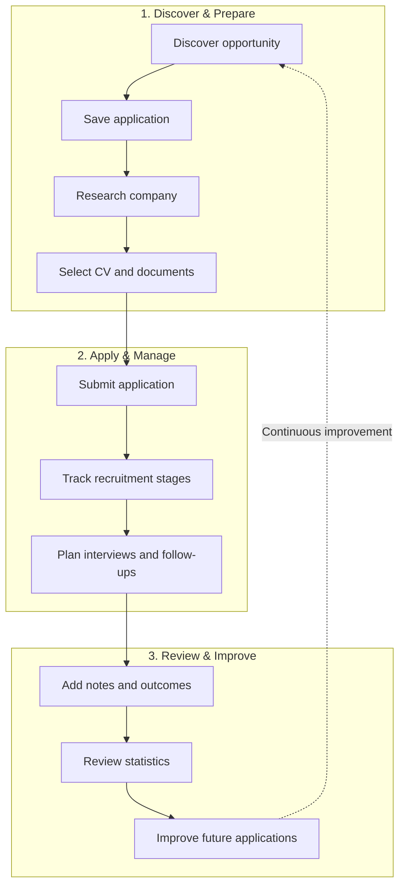
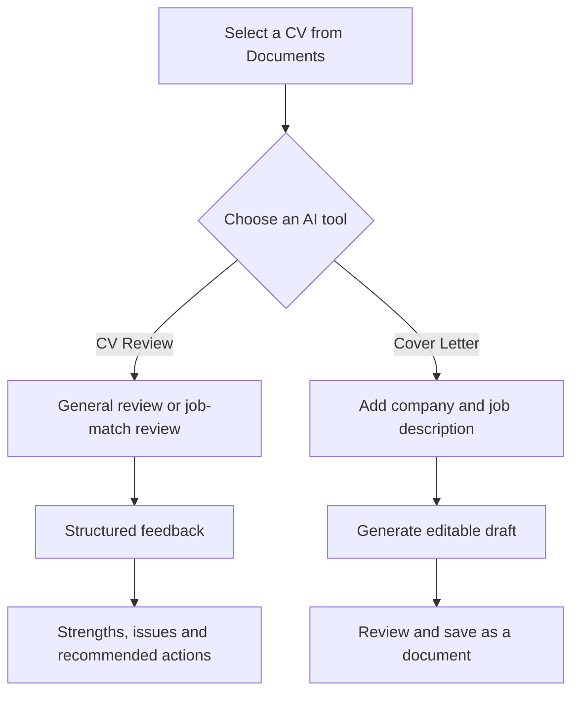
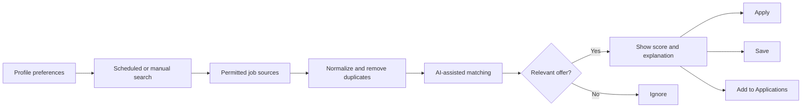
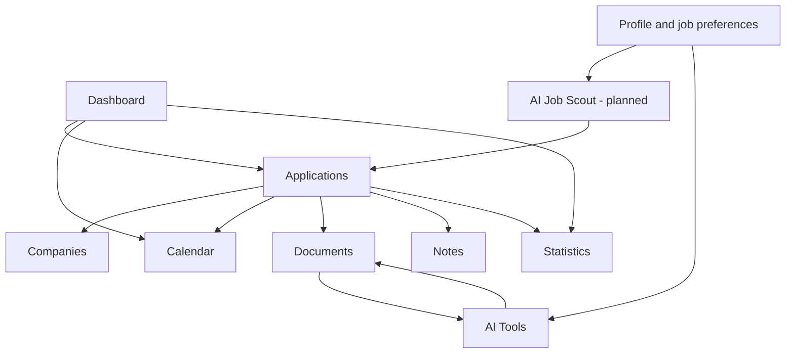
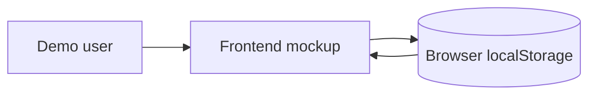
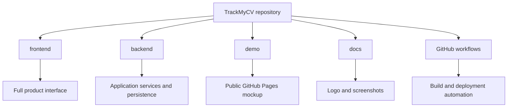

  

<h1 align="center">TrackMyCV</h1>

  <strong>A modern recruitment workspace for tracking job applications, organizing career documents and improving the job-search process.</strong>

  
  
  
  
  
  
  

  <a href="https://avuii.github.io/TrackMyCV/"><strong>Open Live Demo</strong></a>

> [!IMPORTANT]
> The public GitHub Pages version is a **frontend-only portfolio mockup**. It uses demo data and browser storage to present the product concept, navigation and user experience. It does not represent production authentication, real user data or the complete full-stack environment.

---

## Table of Contents

- [Overview](#overview)
- [Project at a Glance](#project-at-a-glance)
- [The Problem](#the-problem)
- [Product Workflow](#product-workflow)
- [Application Sections](#application-sections)
- [Core Features](#core-features)
- [AI Career Tools](#ai-career-tools)
- [Planned AI Job Scout](#planned-ai-job-scout)
- [How the Modules Connect](#how-the-modules-connect)
- [Current Status](#current-status)
- [Demo Scope](#demo-scope)
- [Development Checklist](#development-checklist)
- [Technology](#technology)
- [Repository Overview](#repository-overview)
- [Author](#author)

---

## Overview

**TrackMyCV** is a web application designed to support the complete job-search process in one place.

The project combines application tracking, employer research, recruitment events, documents, notes, statistics and AI-assisted career tools in a single workspace. It is especially useful for students, graduates, interns, junior candidates and people managing several recruitment processes at the same time.

The main goal is to replace a fragmented workflow built from spreadsheets, emails, browser bookmarks, calendar entries and separate document folders with one connected system.

---

## Project at a Glance

| Area | Description |
|---|---|
| **Product goal** | Help users organize, understand and improve their recruitment process |
| **Target users** | Students, graduates, interns, junior candidates and active job seekers |
| **Core value** | One workspace for applications, companies, events, files, notes and progress analysis |
| **Public version** | Frontend-only interactive mockup deployed through GitHub Pages |
| **Full application direction** | React and TypeScript frontend with ASP.NET Core and SQL Server |
| **Current focus** | Calendar improvements, document workflows, AI tools and recruitment automation |
| **Future direction** | Personalized job discovery, reminders and AI-assisted career preparation |

---

## The Problem

A single recruitment process can include much more than a job link.

| Recruitment information | Where it is usually scattered |
|---|---|
| Job offer | Browser bookmarks or job portals |
| CV version | Local folders or cloud storage |
| Company research | Notes, documents or browser tabs |
| Recruiter messages | Email or LinkedIn |
| Interview date | Personal calendar |
| Technical task | Email attachments or separate files |
| Follow-up reminder | Memory, notes or calendar |
| Recruitment result | Spreadsheet or nowhere |

When several recruitment processes happen at once, it becomes easy to lose context, forget deadlines or use the wrong document.

TrackMyCV connects those elements into one structured workflow.

---

## Product Workflow

---

## Application Sections

The application is divided into connected modules representing different parts of the recruitment process.

| Preview | Section | Description |
|---|---|---|
|  | **Dashboard** | Main overview with recruitment summary cards, recent applications, upcoming events, application-status charts and success indicators. It helps the user understand the current situation without opening every process separately. |
|  | **Applications** | Central recruitment workspace with search, filters, statuses, job details, work mode, location, source, next steps and related documents. |
|  | **Companies** | Employer profiles with locations, industries, career links, research notes, response history and related applications. |
|  | **Statistics** | Recruitment analytics including response rate, interview rate, active processes, application categories, seniority levels and best sources. |
|  | **Calendar** | Month, week and day views for interviews, recruiter calls, technical tasks, online tests, deadlines and follow-up reminders. |
|  | **Documents** | Management of CV versions, cover letters, portfolio links, certificates, task descriptions and other recruitment resources. |
|  | **Notes** | Interview preparation, company research, technical questions, recruiter-call summaries, checklists and personal reminders. |

---

## Core Features

### Applications

The Applications module is the central part of TrackMyCV.

Users can organize:

- company and position,
- category and experience level,
- application date,
- source and job-offer link,
- location and work mode,
- recruitment status,
- requirements and benefits,
- last contact and next action,
- assigned CV and related documents,
- notes and preparation materials.

Example recruitment stages:

| Early stage | Active process | Final stage |
|---|---|---|
| Saved | In progress | Offer |
| Preparing | Recruiter contact | Rejected |
| Applied | Interview | No response |
| Follow-up needed | Task / test | Archived |

### Calendar

The Calendar module supports:

- HR and technical interviews,
- recruiter calls,
- online tests,
- recruitment tasks,
- application deadlines,
- follow-up reminders,
- company research sessions,
- CV update reminders.

| View | Use case |
|---|---|
| **Month** | High-level overview of recruitment activity |
| **Week** | Planning events across individual days |
| **Day** | Hour-based schedule with precise event placement |
| **Upcoming events** | Quick access to the nearest recruitment activities |

Events may include a title, company, date, time range, location, meeting link, icon, color and detailed plan.

### Documents

The Documents module helps users manage different versions of recruitment materials.

Supported document categories include:

- CV,
- cover letter,
- portfolio,
- GitHub profile,
- LinkedIn profile,
- job offer,
- task description,
- recruiter email,
- certificate,
- other recruitment files.

| Metadata | Purpose |
|---|---|
| Language | Distinguish local and international versions |
| Target role | Connect a document to a career direction |
| Tags | Improve filtering and organization |
| Status | Mark drafts, active documents and archived versions |
| Related applications | Track where a document was used |
| Last used date | Identify outdated versions |
| Default selection | Speed up common application workflows |

### Statistics

The Statistics module transforms recruitment history into useful insights.

| Insight | Why it matters |
|---|---|
| Applications by status | Shows the size and health of the current pipeline |
| Response rate | Helps evaluate application effectiveness |
| Interview rate | Indicates how often applications move forward |
| Applications by category | Shows which career paths receive the most attention |
| Applications by level | Helps compare internship and junior opportunities |
| Best sources | Identifies which job portals or channels are most effective |
| Activity over time | Makes changes in consistency and results easier to notice |

### Profile and Personalization

TrackMyCV includes profile and workspace settings for:

- preferred job categories,
- target experience levels,
- preferred locations,
- work-mode preferences,
- follow-up timing,
- no-response and ghosting thresholds,
- light, dark and system themes,
- accent colors,
- interface density,
- animations,
- notification preferences.

These settings also prepare the application for future personalized job discovery.

---

## AI Career Tools

TrackMyCV is being expanded from a recruitment tracker into an active career-support workspace.

### AI CV Review

The user selects a stored CV and chooses one of two review modes:

| Review mode | Result |
|---|---|
| **General CV Review** | Structure, clarity, strengths, weaknesses and recommended improvements |
| **Job Match Review** | Comparison with a selected job description, matching skills, missing keywords and fit assessment |

The review may contain:

- overall assessment,
- category scores,
- strengths,
- priority issues,
- ATS-oriented feedback,
- relevant and missing keywords,
- section-level recommendations,
- recommended next actions.

The original document is not changed automatically.

### AI Cover Letter Generator

The generator creates an editable cover-letter draft based on:

- a selected CV,
- company name,
- target position,
- job description,
- preferred language,
- tone,
- length,
- additional user context.

The workflow is designed to save time without inventing experience or qualifications.

### AI Workflow

---

## Planned AI Job Scout

A future **AI Job Scout** module will help users discover opportunities matching preferences stored in their profile.

### Planned Matching Criteria

| Category | Examples |
|---|---|
| Target roles | .NET Developer, Cybersecurity Intern, IAM Analyst |
| Experience level | Internship, Junior, Junior-friendly |
| Technologies | C#, ASP.NET Core, React, SQL, Entra ID |
| Locations | Łódź, Warsaw, Remote |
| Work mode | Remote, hybrid, onsite |
| Exclusions | Senior, Lead, Principal or unrelated roles |
| Notification threshold | Only offers above a selected match score |

### Planned User Actions

- open the original application link,
- save an interesting offer,
- ignore an irrelevant result,
- add the offer directly to Applications,
- avoid duplicate recommendations,
- receive notifications only for newly discovered matches.

---

## How the Modules Connect

The modules are intended to share recruitment context instead of operating as isolated pages.

---

## Current Status

| Product area | Status | Notes |
|---|---:|---|
| Dashboard | ✅ Available | Recruitment overview and quick insights |
| Applications | ✅ Available | Tracking, details, filters and recruitment statuses |
| Companies | ✅ Available | Employer profiles and recruitment context |
| Statistics | ✅ Available | Charts, metrics and source analysis |
| Calendar | ✅ Available | Month, week, day and upcoming-event views |
| Documents | ✅ Available | Recruitment files, links and metadata |
| Notes | ✅ Available | Preparation, research and checklists |
| Profile and appearance | ✅ Available | Preferences and workspace personalization |
| AI CV Review | ✅ Available | General and job-match review |
| AI Cover Letter Generator | ✅ Available | Editable application-specific drafts |
| AI review history | ✅ Available | Previous CV analyses |
| Reminder automation | 🚧 In development | Follow-ups and event notifications |
| AI Job Scout | ⏳ Planned | Personalized discovery and matching |
| Production release | ⏳ Planned | Stable public full-stack deployment |

Legend: ✅ available · 🚧 in development · ⏳ planned

---

## Demo Scope

The public GitHub Pages deployment is an interactive frontend mockup.

### What the Demo Presents

| Demo capability | Included |
|---|---:|
| Navigation across main sections | ✅ |
| Frontend login experience | ✅ |
| Add-application workflow | ✅ |
| Local application status changes | ✅ |
| Search and filters | ✅ |
| CSV export | ✅ |
| Dashboard and statistics based on demo data | ✅ |
| Profile and appearance customization | ✅ |
| Light and dark themes | ✅ |
| Editable notes | ✅ |
| Responsive interface preview | ✅ |

### How the Demo Stores Data

The mockup:

- uses demo data,
- stores selected changes in the browser,
- does not connect to a production database,
- does not use real authentication,
- does not contain real CV files,
- does not contain private application history,
- does not contain production secrets.

### Demo vs Full Application

| Area | Public Mockup Demo | Full Application Direction |
|---|---|---|
| Purpose | Portfolio and UX presentation | Real recruitment management |
| Data | Mock data and browser storage | User-owned persistent data |
| Authentication | Frontend simulation | Backend-controlled access |
| Integrations | Demonstration only | Connected services and AI tools |
| Deployment | GitHub Pages | Full-stack environment |
| Intended use | Explore the concept | Manage an actual job search |

---

## Development Checklist

The checklist below presents the current implementation status without assigning fixed release phases.

**Legend**

- [x] Completed
- [ ] Planned
- [ ] ⏳ In progress

### Recruitment Workspace

- [x] Dashboard and recruitment summary
- [x] Application tracking
- [x] Detailed recruitment statuses
- [x] Search, filtering and sorting
- [x] Company profiles
- [x] Statistics and progress analysis
- [x] Documents and notes
- [ ] ⏳ Improve relationships between applications, companies, documents, notes and events
- [ ] Add a complete activity timeline
- [ ] Add comparison tools for selected job offers
- [ ] Add easier comparison of active recruitment processes

### Calendar and Reminders

- [x] Month view
- [x] Week view
- [x] Day view
- [x] Upcoming events panel
- [x] Custom event types
- [x] Event icons and colors
- [x] Hour-based day planning
- [x] Live current-time indicator
- [x] Overlapping event handling
- [ ] Add automatic follow-up suggestions
- [ ] Add configurable reminders
- [ ] Add in-app notifications
- [ ] Add email notifications
- [ ] Connect deadlines more closely with applications

### Documents and Preparation

- [x] Multiple recruitment document categories
- [x] Document details and metadata
- [x] Application-document relationships
- [x] Notes, checklists and attachments
- [x] Default-document selection
- [ ] Add CV version comparison
- [ ] Add reusable application-document templates
- [ ] Add interview-preparation collections
- [ ] Add company-specific preparation workspaces
- [ ] Add better document usage history

### AI Career Tools

- [x] General AI CV Review
- [x] Job-match CV Review
- [x] AI Cover Letter Generator
- [x] Editable generated drafts
- [x] Saved CV review history
- [ ] Add comparison between CV versions
- [ ] Add AI interview-question preparation
- [ ] Add job-description summaries
- [ ] Add application-specific recommendations
- [ ] Add suggested document selection for an application

### AI Job Scout

- [ ] ⏳ Complete job-search preferences in the user profile
- [ ] Add manual job discovery
- [ ] Add configurable scheduled searches
- [ ] Integrate permitted job sources, APIs and feeds
- [ ] Normalize discovered offers
- [ ] Detect and remove duplicate offers
- [ ] Add AI-assisted match scoring
- [ ] Explain matching strengths and missing requirements
- [ ] Provide direct links to original application forms
- [ ] Add Save and Ignore actions
- [ ] Add selected offers directly to Applications
- [ ] Prevent offers already added to Applications from appearing as new
- [ ] Notify users only about newly discovered matching opportunities

### User Experience

- [x] Responsive desktop interface
- [x] Light theme
- [x] Dark theme
- [x] System theme
- [x] Accent-color personalization
- [x] Interface-density settings
- [x] Optional animations
- [ ] ⏳ Continue mobile usability improvements
- [ ] Improve accessibility
- [ ] Improve loading, empty and error states
- [ ] Add first-time user onboarding
- [ ] Add dashboard customization

### Product Quality and Delivery

- [x] Frontend mockup deployed with GitHub Pages
- [x] Repository screenshots and product documentation
- [x] Docker-based development direction
- [ ] ⏳ Expand automated test coverage
- [ ] Add complete production deployment
- [ ] Add health checks and production monitoring
- [ ] Improve structured logging and error reporting
- [ ] Prepare a stable public full-stack release
- [ ] Expand technical and user documentation

---

## Technology

| Layer | Technologies |
|---|---|
| Frontend | React, TypeScript, Vite, Tailwind CSS |
| UI and visualization | Lucide React, Recharts |
| Backend | C#, ASP.NET Core, REST API |
| Data | Entity Framework Core, SQL Server |
| AI-assisted features | CV analysis and document generation |
| Development | Git, GitHub, Visual Studio, VS Code |
| Design and documentation | Figma, Mermaid, repository screenshots |
| Delivery | GitHub Pages demo, Docker-based development direction |

---

## Repository Overview

| Directory | Purpose |
|---|---|
| `frontend/` | Main React and TypeScript frontend |
| `backend/` | ASP.NET Core application and persistence layer |
| `demo/` | Frontend-only mockup used by the public GitHub Pages demo |
| `docs/` | Logo, screenshots and project documentation |
| `.github/workflows/` | Repository automation |
| `docker-compose.yml` | Local multi-service development setup |
| `scripts/` | Development helper scripts |

---

## Author

Created by **Katarzyna Stańczyk**.
